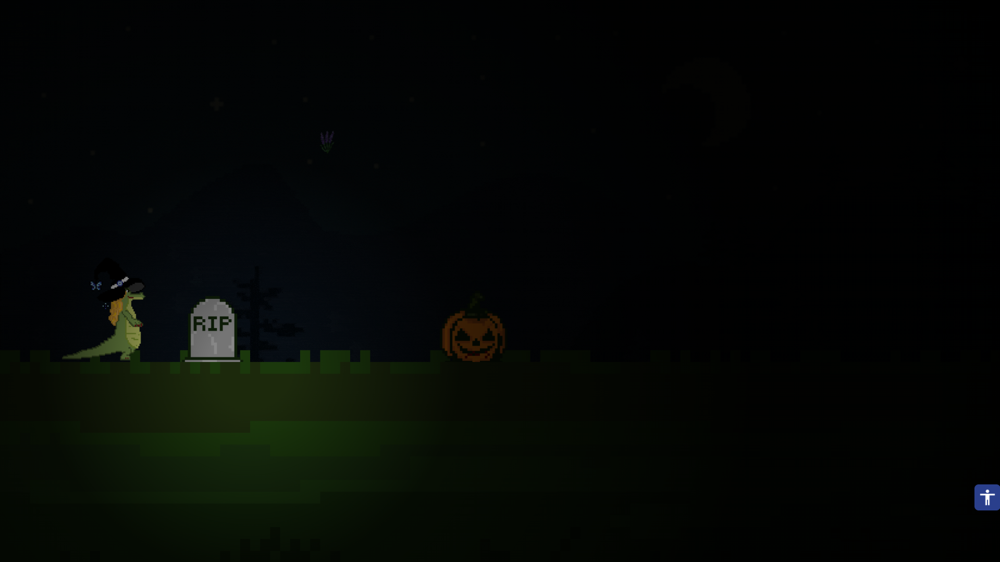
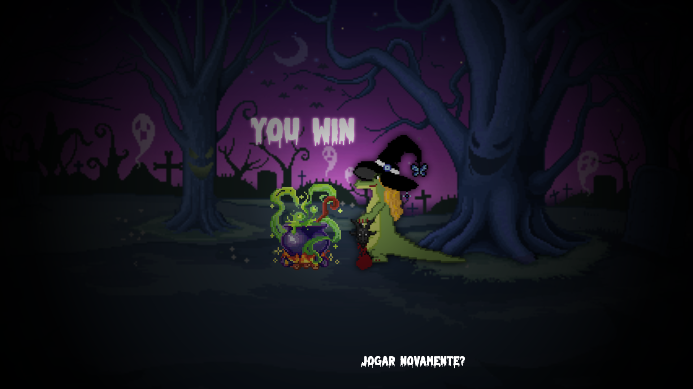
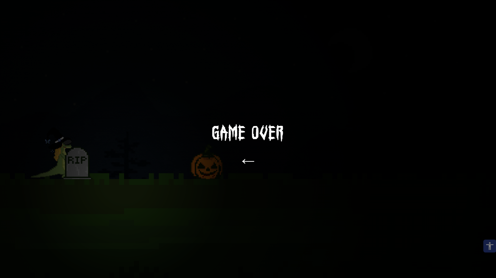

# O Feitiço da Cuca

> Jogo web inspirado no clássico dinossauro do Google, com uma ambientação de Halloween e a Cuca, personagem do folclore brasileiro, como protagonista. Corra, desvie dos obstáculos e colete os 3 itens mágicos antes que o tempo (ou um tropeço) acabe com seu feitiço.


---

## Sobre o projeto

**O Feitiço da Cuca** é um jogo *endless runner* que reimagina a mecânica clássica do dinossauro do Chrome com uma temática sombria e divertida de Halloween, tendo a **Cuca** como personagem principal.

O objetivo não é apenas sobreviver: para completar o feitiço da Cuca e vencer o jogo, é preciso **coletar os 3 itens mágicos** espalhados pelo caminho enquanto desvia dos obstáculos. Errar o pulo ou o desvio significa **game over**, encerrando a tentativa de feitiço antes da hora.

---

## Funcionalidades

- **Jogabilidade estilo *endless runner*** — inspirada no dinossauro do Google, com dificuldade crescente
- **Temática de Halloween** — visual sombrio e divertido com a Cuca como protagonista
- **Coleta de itens mágicos** — 3 itens espalhados pelo cenário, necessários para completar o feitiço
- **Condição de vitória** — colete os 3 itens para concluir o feitiço e vencer o jogo
- **Game over** — colidir com um obstáculo antes de completar a coleta encerra a partida
- **Controles simples** — pule e desvie com poucas teclas, direto ao ponto

---

## Capturas de tela
<div align="center"> <div style="display: flex; justify-content: center; gap: 10px;">   </div> </div>


---

## Tecnologias utilizadas

- [HTML5](https://developer.mozilla.org/pt-BR/docs/Web/HTML)
- [CSS3](https://developer.mozilla.org/pt-BR/docs/Web/CSS)
- [JavaScript](https://developer.mozilla.org/pt-BR/docs/Web/JavaScript)

---

## Como executar o projeto

### Pré-requisitos

- Um navegador atualizado
- (Opcional) [VS Code](https://code.visualstudio.com/) com a extensão **Live Server**

### Passo a passo

```bash
# Clone o repositório
git clone https://github.com/marianafloriano1/FeiticoDaCuca.git

# Acesse a pasta do projeto
cd FeiticoDaCuca

# Abra o arquivo index.html no navegador

```

Ou, se estiver usando o Live Server no VS Code, basta clicar em **Go Live** com o arquivo `index.html` aberto.

---

## Como jogar

- Pressione a tecla de **pular** para desviar dos obstáculos
- Colete os **3 itens mágicos** espalhados pelo caminho
- Ao coletar todos os itens, o feitiço da Cuca se completa e você vence
- Se colidir com um obstáculo antes disso, é **game over**

---

## Contato


Desenvolvido por **Mariana Santanna** e **Rafaela Santos**

**Mariana Santanna**
- GitHub: [@marianafloriano1](https://github.com/marianafloriano1)
- E-mail: marianafloriano24@gmail.com
- LinkedIn: [www.linkedin.com/in/marianafsantanna](https://www.linkedin.com/in/marianafsantanna)

**Rafaela Santos**
- GitHub: [@RafaApS](https://github.com/RafaApS)
- E-mail: rafaela132006@gmail.com
- LinkedIn: [www.linkedin.com/in/rafaelaapsantos](https://www.linkedin.com/in/rafaelaapsantos)
